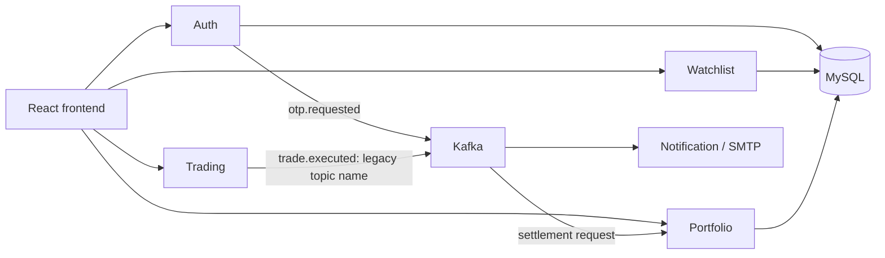

# MarketQuest AI

A learning project for paper trading, portfolio accounting and personal watchlists. The working application uses Java 21, Spring Boot, MySQL, Kafka, and React/Redux in `frontendr`.

**Current scope:** five implemented backend services. AI coaching, contests, leaderboards, learning, the separate stock-market service and gateway routing are planned scaffolds, not implemented features. The project name does not mean an AI model is currently integrated. The frontend calls the implemented services directly.

## Implemented services

| Service | Port | Responsibility |
|---|---:|---|
| auth-service | 8081 | Email OTP signup, login, JWT issuance, password change, profile images |
| watchlist-service | 8082 | User-owned stocks and research notes |
| notification-service | 8086 | Consume OTP events and send email through SMTP |
| trading-service | 8084 | Instrument catalogue, provider/reference quotes, submit paper orders |
| portfolio-service | 8085 | Cash, holdings, settlement/rejection, trade history, realized/unrealized P/L |



JWT signatures and expiration are validated in each user-facing service. Identity comes from the token. A portfolio URL must match its token owner. The shared HMAC key is appropriate for this local learning setup; public deployments should use an identity provider or asymmetric signing.

## Local setup (Windows)

1. Install JDK 21, Maven, Node 24, MySQL Server and Docker Desktop. Start Docker's Linux engine and MySQL.
2. Copy `.env.example` to `.env` **only if you do not already have `.env`**. Fill in the database URLs, usernames/passwords and SMTP settings. Create the databases and grant your application user access. The example recommends separate databases, but an existing shared local schema also works.
3. Set `JWT_SECRET` to a private random value of at least 32 bytes. One way to generate a value in PowerShell is:

   ```powershell
   node -e "console.log(require('crypto').randomBytes(48).toString('hex'))"
   ```

   Copy the result into `.env`. Do not commit it. All four HTTP services read the same key. Changing it invalidates existing logins.
4. Set SMTP credentials for actual OTP email. Signup requires email; SMS is not implemented. A profile image is optional (JPEG/PNG, maximum 2 MB). `FINNHUB_TOKEN` is optional: without it, quotes use labelled fixed reference prices.
5. From the repository root:

   ```powershell
   .\scripts\start-dev.ps1
   ```

   The script checks prerequisites, starts Kafka/Zookeeper, waits for Kafka, then launches the five implemented services. It does not start MySQL or the frontend. Look for Spring's `Started ...` message in each file under `tmp/dev-logs`; launching a process alone does not establish readiness.
6. In another terminal:

   ```powershell
   cd frontendr
   npm ci
   npm run dev
   ```

   Open `http://localhost:5173`. If that port is occupied, stop the previous frontend instance; backend CORS allows localhost/127.0.0.1 on port 5173.

To stop the backend, run `./scripts/stop-dev.ps1`. To run one service, enter its folder and run `mvn spring-boot:run`; folders containing a wrapper also support `./mvnw.cmd spring-boot:run`.

## Order and accounting semantics

- The server chooses execution price and currency from its instrument catalogue/quote service. A client-supplied currency cannot convert USD trades into INR trades.
- HTTP `202` with `PENDING` means Kafka acknowledged the order message. It does **not** mean settlement succeeded. The frontend polls for that order's final history entry.
- Portfolio settlement checks cash before buying and holdings before selling. It writes balances, holdings and the final history entry in a database transaction. Replaying an already recorded trade ID has no additional effect.
- The event class `TradeExecutedEvent` and topic `trade.executed` are legacy names retained for compatibility. Their payload actually requests settlement; history determines `EXECUTED` or `REJECTED`.
- Monetary calculations use `BigDecimal`. Weighted average cost, realized P/L and unrealized P/L are separate. Daily realized totals use all executed sales and the Asia/Kolkata date, grouped by currency.
- Version columns prevent silently overwriting concurrent cash/holding changes. A conflicting HTTP mutation can still require retrying; this is not a full production order ledger.
- Manual marking updates your own demo portfolio's valuation. Prices are not automatically refreshed for every holding, and the decorative chart is not historical market data.

## Existing local data

Old watchlist rows have no authenticated owner and are deliberately not shown to new users. They remain in the database; add your stocks again under the correct account. Old `user1` paper portfolios are not automatically assigned to a real user. No existing user data was deleted by the review changes.

Development uses Hibernate `ddl-auto=update`. Back up data before schema changes. Portfolio version columns use a default of zero; for a database where an earlier nullable version column was already created, run `UPDATE demo_accounts SET version = 0 WHERE version IS NULL;` and the equivalent update for `demo_holdings` before using those rows. Production should use versioned migrations instead.

## Verification

From each implemented backend service folder, run `mvn test`. Tests use H2 for database-backed services and disable Kafka listeners; they do not verify actual MySQL, broker or SMTP connectivity. Regression tests cover token tampering/expiry, watchlist ownership, order currency/price, OTP expiry/attempts, cash/holdings rejection, replay handling and profit calculations.

In `frontendr`, run `npm run lint` and `npm run build`. GitHub workflows run the backend tests and frontend lint/build.

See [the review and interview guide](docs/interview-readiness.md) for demo steps and remaining limitations.
